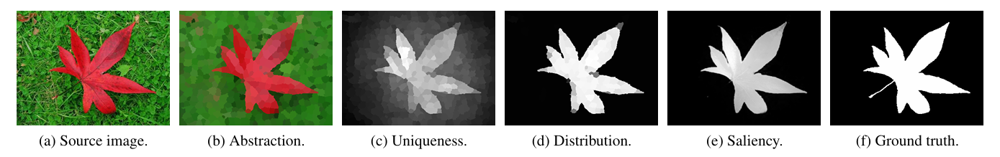
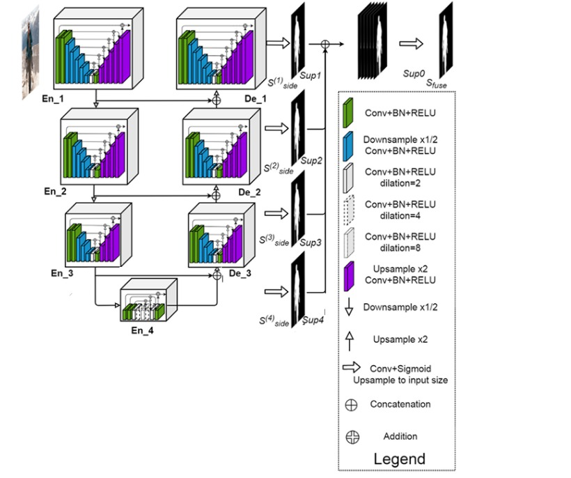
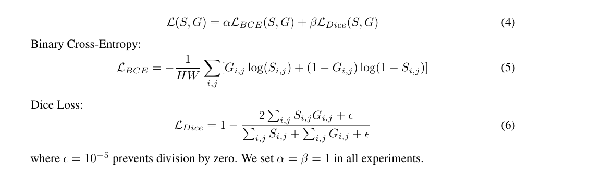
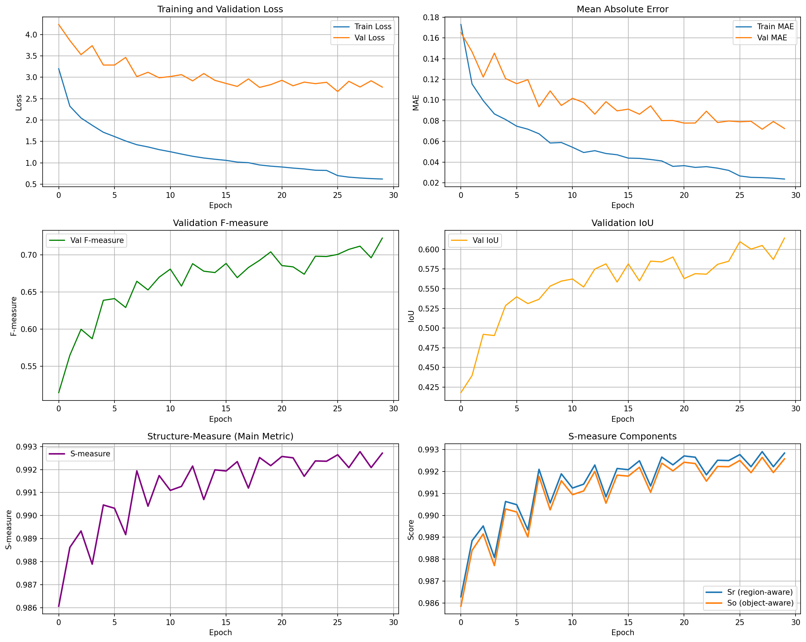
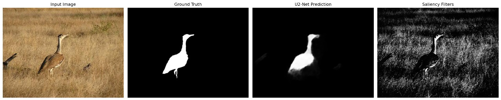
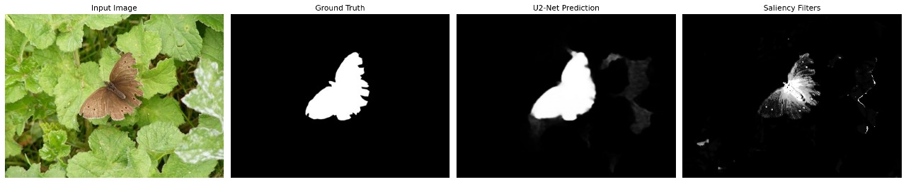
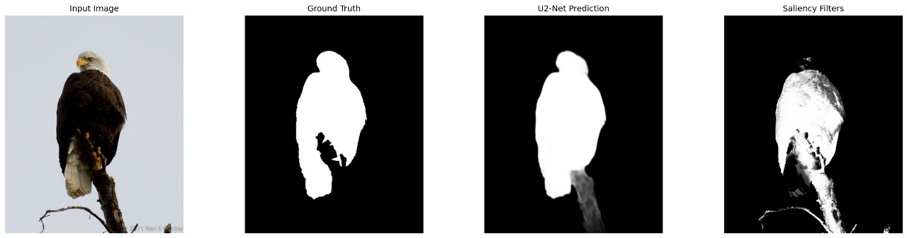
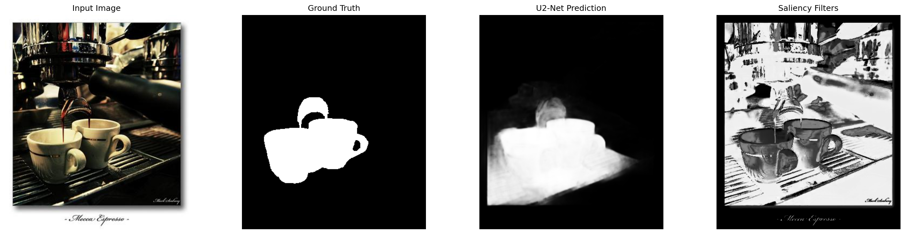

# Salient Object Detection using U²-Net

This repository implements **Salient Object Detection (SOD)** using a **lightweight U²-Net (U²-Net Lite)** and compares it with a **classical saliency method (Saliency Filters)**.

The project focuses on understanding and comparing **classical computer vision techniques** with **modern deep learning approaches**, while keeping the implementation **simple and easy to follow**.

---

## Objectives

- Implement classical **Saliency Filters** in Python which was originally in C++
- Build a **simplified U²-Net Lite** model  
- Compare classical vs deep learning approaches  
- Analyze performance using quantitative and qualitative metrics  

---

## What is Salient Object Detection?

Salient Object Detection aims to identify the **most visually important object(s)** in an image, similar to how humans naturally focus attention.

**Applications:**
- Image segmentation  
- Object detection  
- Image editing  
- Robotics and vision systems  

---

## Methods Implemented

---

### 1. Saliency Filters (Classical Method)

**File:** `saliency_filters.py`

Based on the paper:  
**Perazzi et al., “Saliency Filters: Contrast Based Filtering for Salient Region Detection”, CVPR 2012**

#### Key Idea
- The image is divided into perceptually homogeneous regions  
- Saliency is computed using:
  - **Color uniqueness**
  - **Spatial distribution**
- No training is required  

#### Characteristics
- Fully unsupervised  
- Mathematical and filter-based  
- Works well on simple, high-contrast images  
- Performs poorly on complex or cluttered scenes  

---

### 2. U²-Net Lite (Deep Learning Method)

U²-Net Lite is a **simplified and lightweight version of U²-Net**, designed to:
- Reduce model size  
- Keep architecture easy to understand  
- Maintain strong segmentation performance  

---

##  U²-Net Lite Architecture

The architecture follows a nested U-structure with **lightweight Residual U-Blocks (RSU-4 Lite)**.

**Key design choices:**
- Reduced encoder–decoder depth  
- Lightweight RSU blocks  
- Multi-scale feature extraction  
- Deep supervision using side outputs  

---

##  Loss Function

We use a **combined loss** to improve segmentation quality.

We use a combination of Binary Cross-Entropy (BCE) Loss and Dice Loss to balance pixel-level accuracy and object-level shape consistency.
BCE loss helps the model learn correct foreground–background classification for each pixel, while Dice loss focuses on improving overlap between the predicted saliency map and the ground truth.
This combination leads to more accurate boundaries and stable training, especially when foreground and background pixels are highly imbalanced.

---

## Training Details

- **Dataset:** DUTS-TR (train), DUTS-TE (test)  
- **Input size:** 320 × 320  
- **Optimizer:** Adam  
- **Epochs:** 30  
- **Framework:** PyTorch  

---

##  Training Performance

The following metrics were monitored during training:
- Training & validation loss  
- Mean Absolute Error (MAE)  
- F-measure  
- IoU  
- Structure-measure (S-measure)  

---

## Quantitative Results

### Performance Comparison (DUTS-TE)

| Method | F-measure ↑ | MAE ↓ | Precision | Recall | IoU | S-measure ↑ |
|------|------------|------|----------|--------|-----|------------|
| Saliency Filters | 0.244 | 0.238 | 0.553 | 0.1346 | – | 0.973 |
| **U²-Net Lite (Ours)** | **0.715** | **0.073** | **0.758** | **0.730** | **0.604** | **0.993** |
| U²-Net (Full) | 0.763 | 0.054 | – | – | – | 0.941 |

---

##  Model Efficiency

| Method | Average Time (seconds) |
|------|------------------------|
| Saliency Filters (CPU) | 0.153 |
| U²-Net Lite | 0.120 |
| U²-Net | 0.033 |

---

## Qualitative Results

The visual comparison includes:
- Input image  
- Ground truth  
- U²-Net Lite prediction  
- Saliency Filters output  

U²-Net Lite produces **cleaner object segmentation** and performs better in complex scenes.

 

Additional results are in Results folder.

---

## Metric Comparison Plots

The plots below compare:
- Structure-measure  
- Precision & Recall  
- Mean Absolute Error  
- F-measure  
- Processing speed  

---
## Key Observations

- **U²-Net Lite achieves 93.7% of the full U²-Net’s F-measure**, with a score of **0.715 vs 0.763**, despite being significantly smaller.
- The **Lite model reduces MAE by 66.14%** compared to classical Saliency Filters (**0.073 vs 0.238**), showing much better pixel-level accuracy.
- **Parameter efficiency:** U²-Net Lite uses **98.3% fewer parameters** than the full U²-Net (**730K vs 44M**), making it highly suitable for resource-constrained environments.

---

## Failure Cases

Despite strong overall performance, **U²-Net Lite** has some limitations:

- **Transparent objects:** Glass, water, and other transparent materials are difficult to segment accurately.
- **Extreme scale variation:** Very small objects (less than 5% of the image area) may be missed.
- **Motion blur:** Heavy blur degrades feature quality and affects saliency prediction.

These cases highlight challenges common to lightweight segmentation models.

---

## Conclusion and Future Work

This work presents **U²-Net Lite**, a lightweight salient object detection architecture that achieves an excellent **accuracy–efficiency trade-off**.

By systematically reducing model complexity—**halving channel sizes** and **reducing encoder stages from 6 to 4**—we achieve a **98% parameter reduction (730K vs 44M)** while retaining **93.7% of the full U²-Net’s F-measure** on the DUTS-TE dataset.

U²-Net Lite significantly outperforms **classical Saliency Filters** across all evaluation metrics, demonstrating the advantage of **learned hierarchical features** over hand-crafted contrast-based approaches.

The inclusion of **S-measure** further highlights U²-Net Lite’s ability to preserve both **structural consistency** and **object boundaries**, making it suitable for **real-time applications**, **edge devices**, and **mobile platforms**.

### Future Work

Possible directions for further improvement include:

1. **Extreme compression:** Pruning, INT8 quantization, and knowledge distillation to reduce model size below 1MB.
2. **Architecture search:** AutoML-based optimization of encoder–decoder configurations.
3. **Multi-task learning:** Joint training for saliency detection, segmentation, and object detection.
4. **Domain adaptation:** Zero-shot or few-shot transfer to domains such as medical and aerial imagery.
5. **Attention mechanisms:** Incorporating self-attention to capture long-range dependencies.
6. **Video SOD:** Extending the model to video with temporal consistency across frames.

This work demonstrates that **careful architectural design** can deliver strong performance with minimal computational resources, making advanced salient object detection accessible to a wider range of real-world applications.

